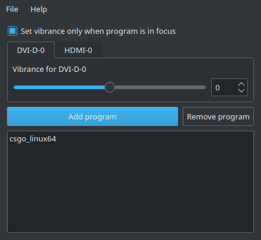
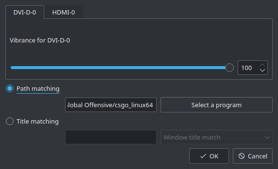

# vibrantLinux AMD

Main Program:



Program entry editor:



vibrantLinux is a graphical tool that serves the same purpose as VibranceGUI on Windows.

This fork of vibrantLinux only supports AMD cards.

There are plans to upstream the changes into vibrantLinux once this was tested on more hardware and polished.

# Compatibility
Works with
 - AMD
   - Radeon RX 5600 XT
   - Radeon RX Vega 56
   - Radeon RX 580
 - Or more? Tell me!
# Requirements

The only things needed to run this program is:

```
git
vibrantx
qt
libxcb (optional)
libxcb-ewmh (optional)
```

vibrantX is a CLI tool written by me that allows easy adjustments to color vibrance. See [vibrantX Project Page](https://gitlab.com/Scrumplex/vibrantx)

# Installation
## AUR
vibrantLinux AMD and vibrantX are both available on the AUR. Check it out [here](https://aur.archlinux.org/packages/vibrantlinux-amd-git/).

## Compile yourself
After installing the requirements including vibrantX (See above) you can build vibrantLinux.

```
git clone https://github.com/Scrumplex/vibrantLinux-AMD.git
cd vibrantLinux-AMD
./update.sh
#or alternatively if you know you don't want to use ewmh to get the active window
./update.sh --noxcb
```
# Roadmap
 - Implement reading current saturation / vibrance from X11 (Probably going to land in vibrantX)
 - Merge AMD and NVIDIA implementation
 - Upstream the changes to vibrantLinux (blocked by task above)
 - Wayland?

# FAQ

## Q: Why is vibrantX hosted on GitLab and this on GitHub?
As I plan to bring these changes upstream it is easier to work on vibrantLinux on GitHub as this is the platform of choice of upstream. I personally prefer GitLab which is why vibrantX is on GitLab instead.

## Q: Does this work on my card?
You tell me! I can only say that it apparently works on AMD GPUs. It could work on Intel if the driver implements the so called "CTM" property


